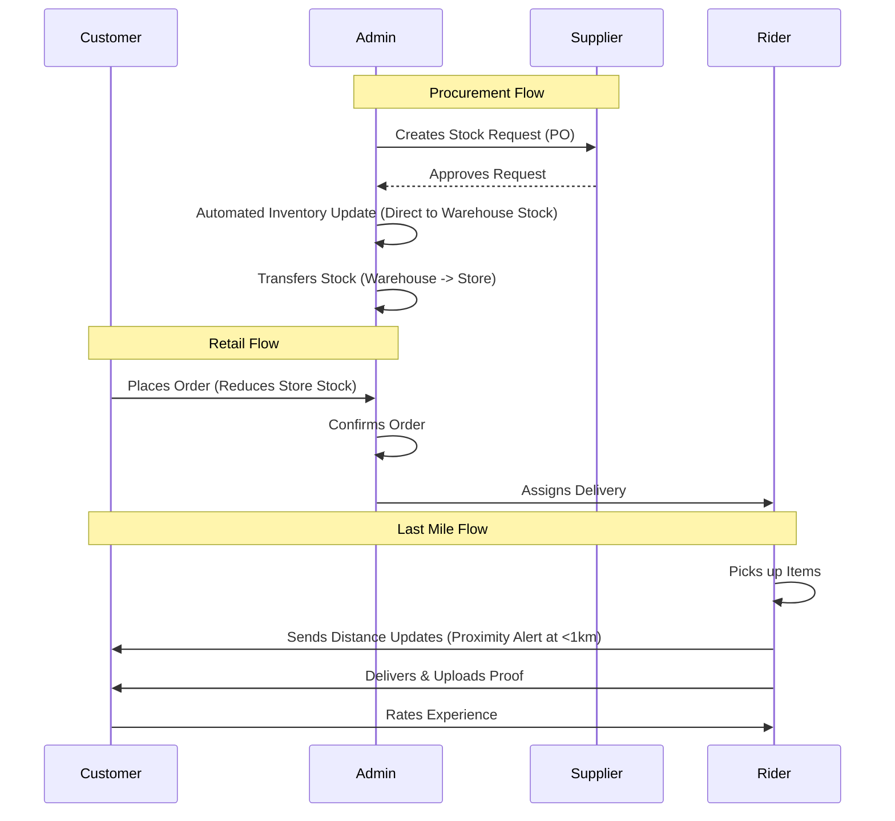

# Data Flow & Architecture

This document tracks how data moves through the HRMS system across the four roles.

## High-Level Visual Flow

## Inventory Logic
The system uses a **Split-Inventory Model**:

| Feature | Logic |
| :--- | :--- |
| **Warehouse Stock** | Incremented by Supplier Deliveries. Managed by Admin. |
| **Store Stock** | Decremented by Customer Orders. Incremented by Admin Transfers. |
| **Variant Stock** | For products with variations (e.g., 500g vs 1kg), stock is managed at the variant level. |

## Status State Machine

### Sale (Retail) Statuses
`pending` -> `confirmed` -> `out_for_delivery` -> `delivered`
*Alternate paths: `cancelled`, `returned`.*

### Purchase Order (Procurement) Statuses
`pending` -> `pending_supplier` -> `accepted` -> `supplier_delivered` -> `received`
*Alternate paths: `rejected`, `cancelled`.*

### Delivery Statuses
`pending` -> `in_progress` -> `delivered`
*Alternate path: `failed`.*
